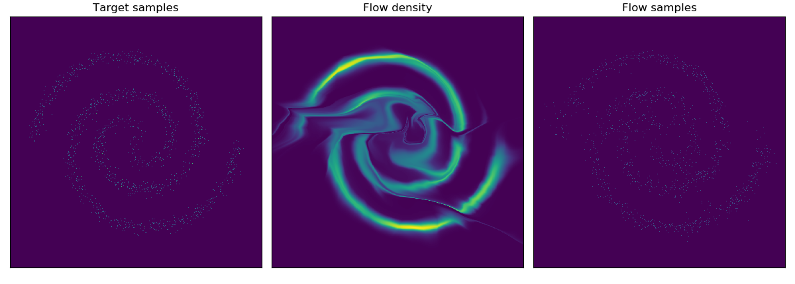

# Glow (2D)

This is an implementation of [Glow: Generative Flow with Invertible 1x1 Convolutions](https://arxiv.org/abs/1807.03039) on 2D dataset, in PyTorch. The code for the Glow model is adapted from 

[https://github.com/kamenbliznashki/normalizing_flows/blob/master/glow.py](https://github.com/kamenbliznashki/normalizing_flows/blob/master/glow.py)


To train the model, do

```shell
python train.py --dataset=8gaussians
                --width=128
                --depth=10
                --n_levels=1
```

For 2D data, the implementation is different from that for real image data in that

- The input is of size `[batch, 2]`, i.e. no channel dimension;

- The 1x1 invertible convolution is simply replaced with 2x2 matrix multiplication;
- Gaussianization is removed.

Sample images during training:

- 2spirals dataset



- 8gaussians dataset

